# SIRHA - FRONT: Sistema Academico de Solicitudes de Horarios


SIRHA-Front es la interfaz de usuario para la gestión de solicitudes de cambios de horarios, o de solicitud de materias. Esta aplicación React permite al estudiante pedir una modificación de su horario academico a traves de solicitudes (Cambio de grupo, cambio de materia), aparte de visualizar su horario actual o de semestres academicos pasados.

## Tabla de Contenidos 📋

- [Integrantes](#integrantes)
- [Caso de Negocio](#caso-de-negocio)
- [Tecnologías Utilizadas](#tecnologías-utilizadas-)
- [Estructura del Proyecto](#estructura-del-proyecto-)
- [Prototipo de Bajo nivel](#Prototipo-Bajo-nivel-)
- [Prototipo de Alto nivel](#Prototipo-Alto-nivel-)
- [Estrategia de versionamiento](#estrategia-de-versionamiento)


## Integrantes

- Anderson Fabian Garcia Nieto
- David Alejandro Patacon Henao 
- Felipe Eduardo Calviche Gallego
- Jared Sebastian Farfan Guevara
- Kevin Arturo Cuitiva Pardo
- Maria Paula Rodriguez Muñoz

## Caso de Negocio
El objetivo principal es darles a estudiantes, profesores y decanaturas una plataforma con herramientas claras para crear, evaluar y aprobar/rechazar solicitudes de cambio de horarios, optimizando la gestión académica y reduciendo conflictos de cupos y cargas.

## Tecnologías Utilizadas 🛠

- **React**: Biblioteca principal para la construcción de la interfaz de usuario
- **CSS**: Estilos personalizados para la interfaz de usuario


## Estructura del Proyecto 📁

```
src/
├── App.js
├── index.js
├── api/
│   └── .gitkeep
├── assets/
│   ├── icons/
│   │   └── .gitkeep
│   └── images/
│       └── login/
├── components/
│   ├── dashboard/
│   │   ├── Dashboard.jsx
│   │   └── MenuButton.jsx
│   ├── groups/
│   │   ├── CapacityBar.jsx
│   │   ├── GroupDetails.jsx
│   │   └── GroupTable.jsx
│   ├── home/
│   │   └── home.jsx
│   ├── layout/
│   │   ├── Header.jsx
│   │   ├── MainLayout.jsx
│   │   └── Sidebar.jsx
│   ├── requests/
│   │   └── requests.jsx
│   ├── schedule/
│   │   ├── Schedule.jsx
│   │   └── ScheduleTable.jsx
│   ├── semaforo/
│   │   └── SemaforoAcademico.jsx
│   ├── student/
│   │   ├── Filters.jsx
│   │   ├── StudentCard.jsx
│   │   ├── StudentDetail.jsx
│   │   └── StudentList.jsx
│   ├── traffic_light/
│   │   └── traffic_light.jsx
│   ├── ui/
│   │   ├── ConfirmDialog.jsx
│   │   ├── MetricCard.jsx
│   │   ├── Modal.jsx
│   │   └── StatusBadge.jsx
│   └── user/
│       └── User.jsx
├── config/
│   └── .gitkeep
├── pages/
│   ├── DashboardEstudiantePage.jsx
│   ├── EstudiantesPage.jsx
│   ├── GruposEstudiantePage.jsx
│   ├── HomePage.jsx
│   ├── LoginPage.jsx
│   ├── RequestsPage.jsx
│   ├── SchedulePage.jsx
│   ├── TrafficLightPage.jsx
│   └── UserPage.jsx
├── services/
│   └── AuthContext.jsx
├── styles/
│   ├── App.css
│   ├── Dashboard.css
│   ├── DashboardEstudiantePage.css
│   ├── Groups.css
│   ├── Home.css
│   ├── index.css
│   ├── Layout.css
│   ├── Login.css
│   ├── MateriaSelector.css
│   ├── MenuButton.css
│   ├── Requests.css
│   ├── Schedule.css
│   ├── Semaforo.css
│   ├── Student.css
│   ├── TrafficLight.css
│   ├── UI.css
│   └── User.css
```

## Prototipo Bajo nivel

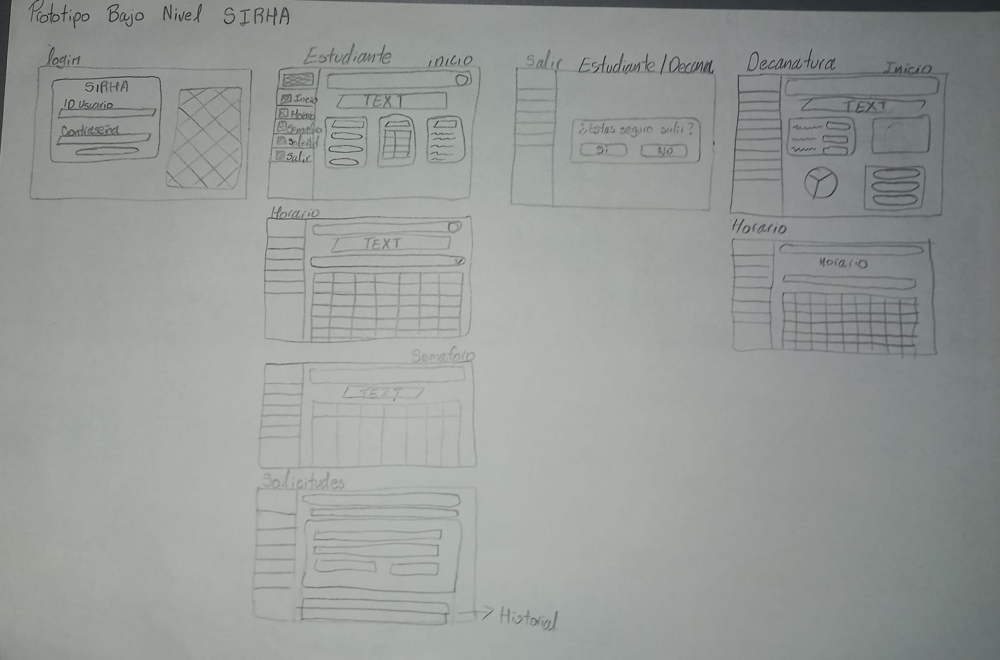

## Prototipo Alto nivel
https://www.figma.com/design/Y1b6jzPJ9DPd1o6IlkdAoM/SIRHA?node-id=2-3401&t=Useu1qVcxROZRnh1-1

## Estrategia de versionamiento

- `main`: Contiene la versión estable y lista para entrega.
- `develop`: Rama de integración de nuevas funcionalidades.
- `feature/*`: Ramas creadas para cada nueva funcionalidad o prototipo.
- `hotfix/*`: Ramas para correcciones críticas en `main`.


---
**Este proyecto se creó con el siguiente comando en la terminal:**

```bash
npx create-react-app usermanagement
```

> Nota: Al crear el proyecto, es importante que el nombre esté en **minúsculas** debido a las restricciones de **npm**.

---

## Requisitos Previos

Asegúrate de tener instalados **Node.js** y **npm** en tu sistema.  
Puedes verificarlo con los siguientes comandos:

```bash
npm -v
```

---

## Instalación

Para instalar las dependencias necesarias, ejecuta:

```bash
npm install react-scripts
```

Este comando asegura que todas las dependencias de **react-scripts** se instalen correctamente, especialmente si hubo algún problema durante la configuración inicial.

---


## Ejecución del Proyecto

Una vez instaladas las dependencias, inicia el servidor de desarrollo con:

```bash
```

Esto abrirá automáticamente la aplicación en tu navegador en:  
👉 [http://localhost:3000](http://localhost:3000)

---

## Actualización de npm

Se recomienda mantener **npm** actualizado para evitar problemas de compatibilidad.  
Para actualizarlo, usa:

```bash
npm install -g npm@latest
```

---
```

## Notas Adicionales

- Para detener el servidor de desarrollo, presiona **Ctrl + C** en la terminal.  
- Si experimentas errores adicionales, intenta limpiar la caché de npm y reinstalar las dependencias:

```bash
npm cache clean --force
npm install
```

---

## Funcionamiento

- Login de ingreso para estudiantes, decanatura o administrador.


- Inicio (Estudiante - Decanatura - Administrador)

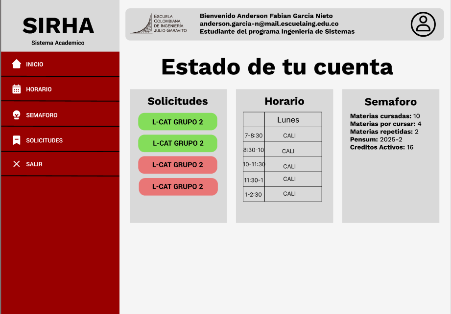


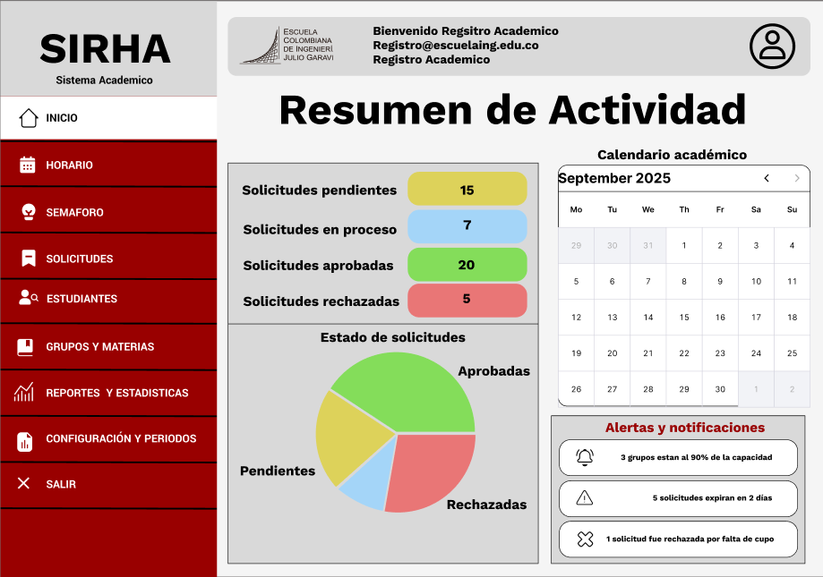

- Semaforo (Estudiante - Decanatura Administrador)

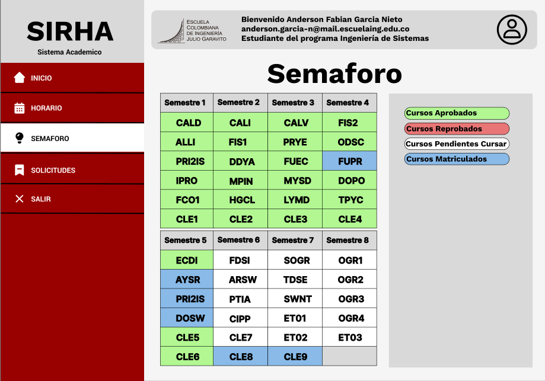


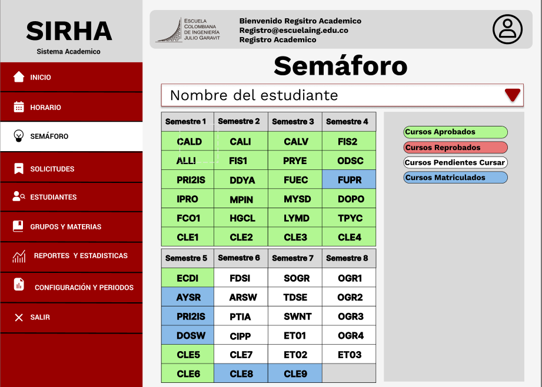

- Solicitudes (Estudiante - Decanatura - Administrador)

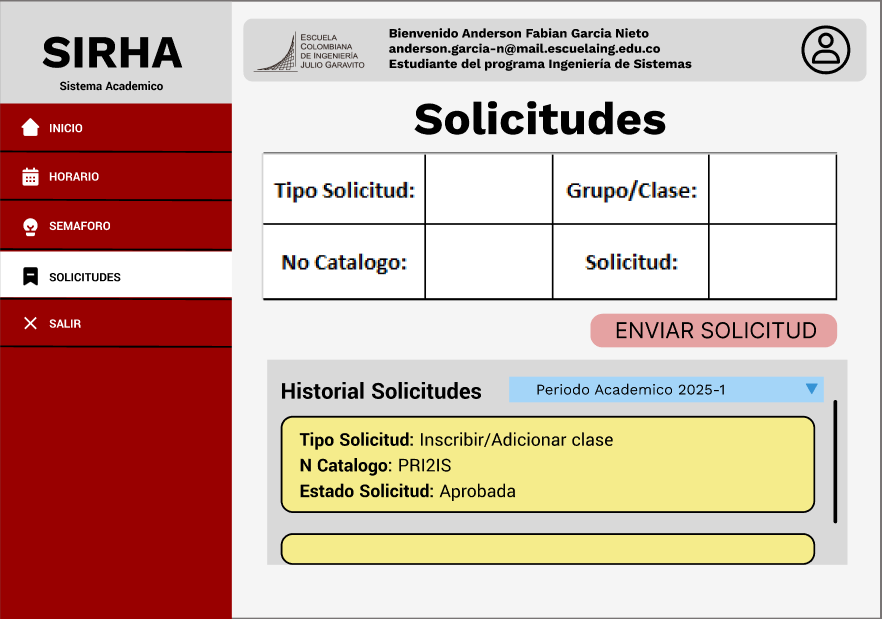

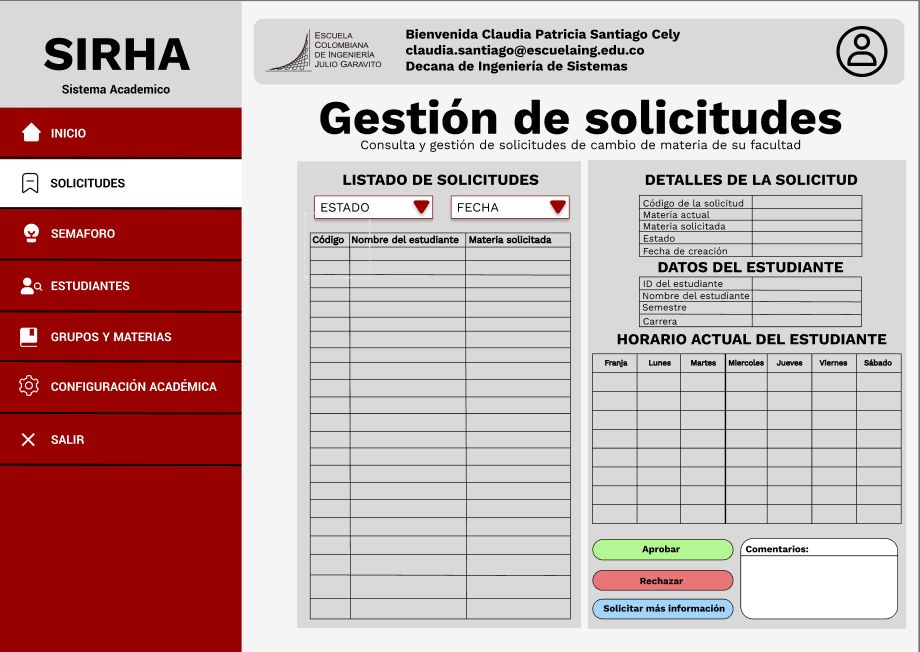

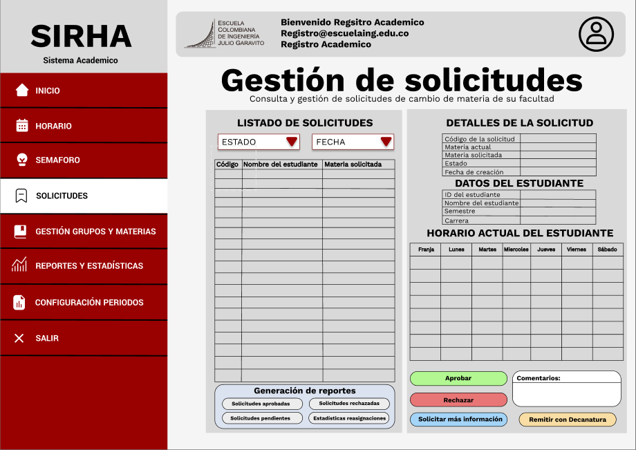

- Horarios (Estudiante -Administrador)

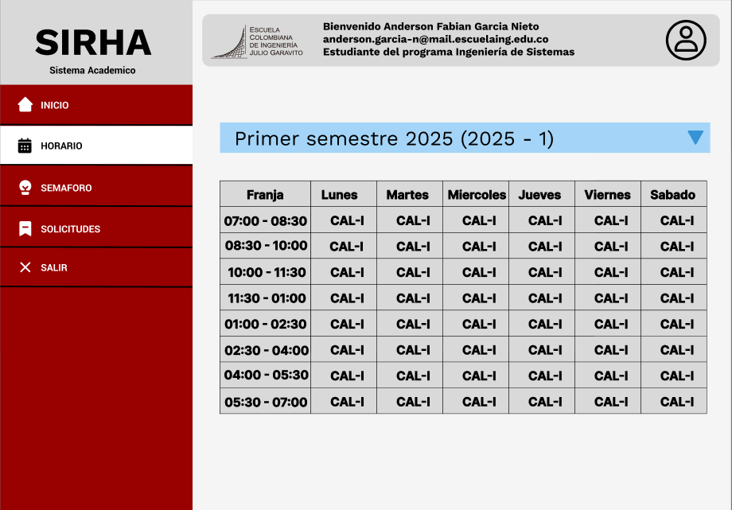

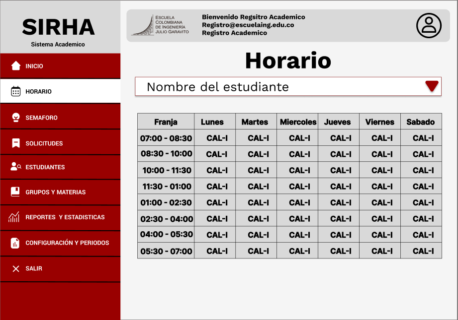

- Gestion de Materias (Decanatura -Adminitrador)

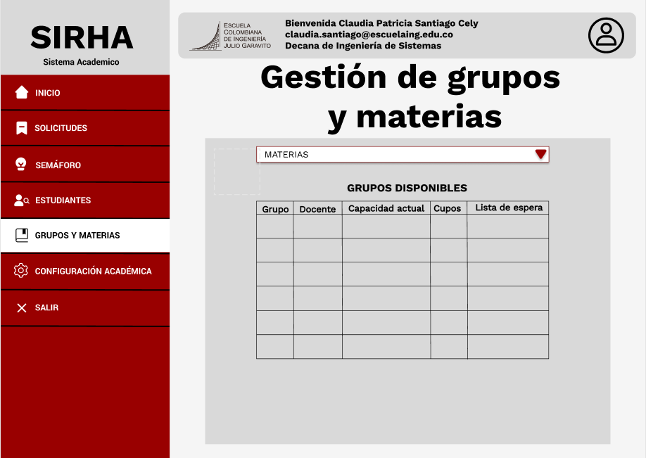

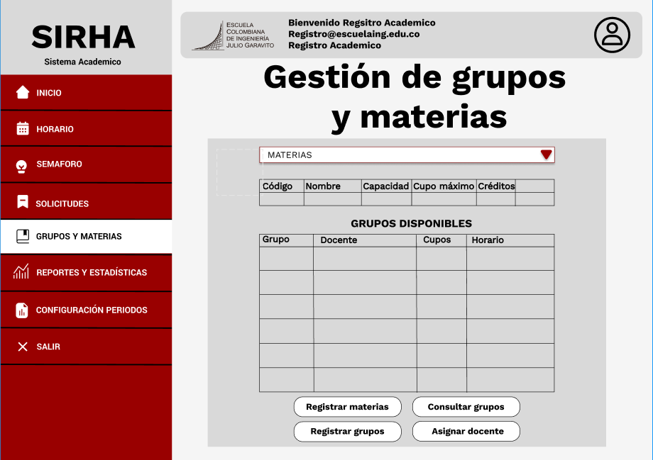

- Estadisticas/Configuración Academica (Decanatura -Adminitrador)

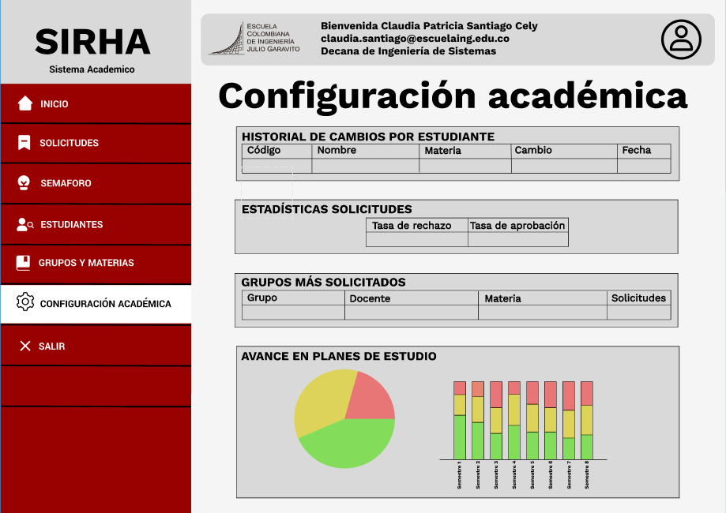

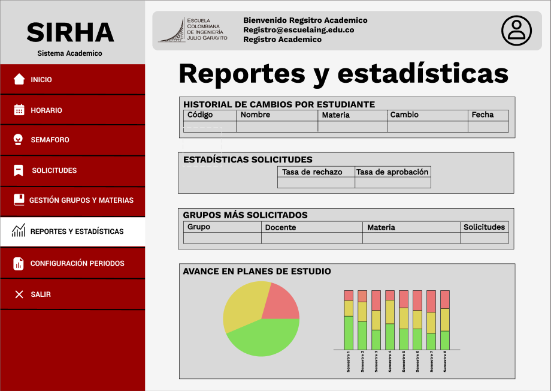

- Estudiantes (Decanatura)

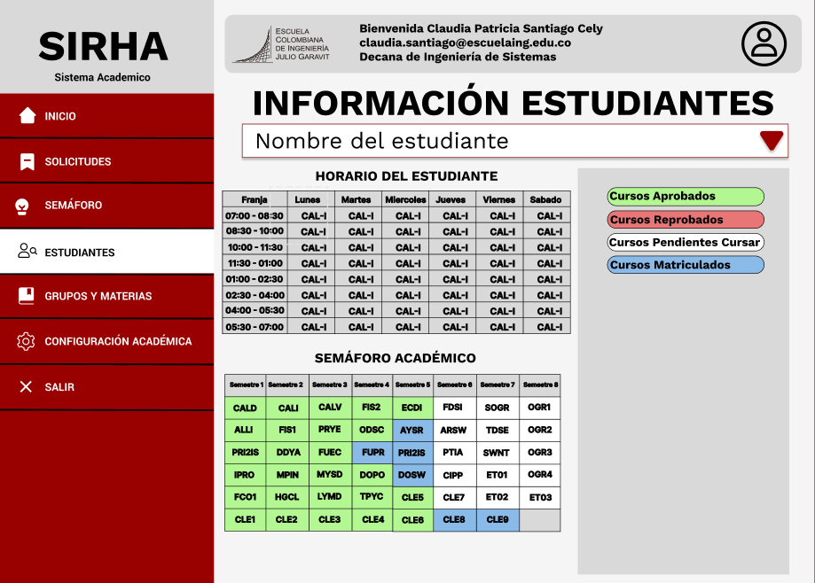
